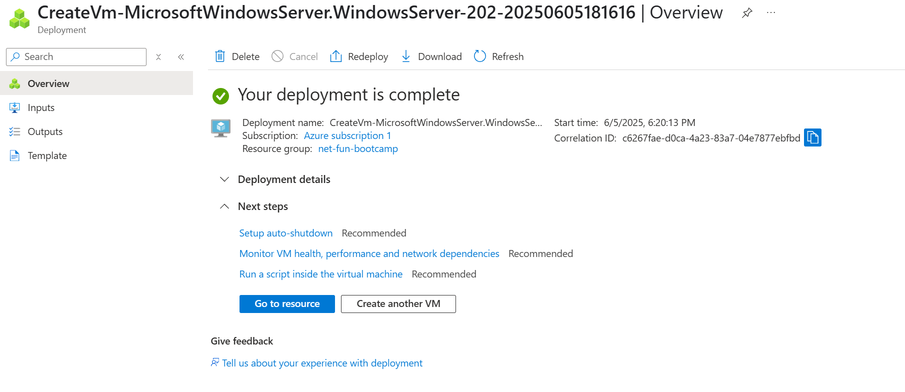
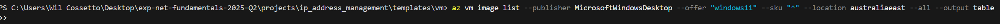

## Downloaded Azure Resource Template

After deploying my Microsoft Windows Server 2025 to Azure VM.
I downloaded the resource templates to be able to easily deploy again.




## Converting Resource Template to Azure Bicep

The VM I launched turned out to use a DataCenter Server which didn't have the normal Windows GUI.
I want to reuse my resource template files, but they are too hard to work with directly. I'm going to convert them to Azure Bicep.

Install and Login Azure CLI
```sh
winget install --exact --id Microsoft.AzureCLI
az login --use-device-code
```

Convert to Azure Bicep
```sh
cd projects/ip_address_management/templates/vm
az bicep decompile --file template.json
```
After decompiling I noticed the files were still verbose.
It turns out that the decompile will make the output 1:1 to the json.
I asked ChatGPT to refactor the code to reduce the verboseness of the code.

## Switching Regions from australiaeast to eastus and then switching back

When attempting to deploy to australiaeast, Azure said the SKU for Windows 11 x86 is not available.
So I checked what was available and nothing was returned. I then asked ChatGPT which confirmed my findings.



Despite this I realised it was the command I was providing which was incorrect.
Instead I ran the following command:
```sh
az vm image list \
>>   --publisher MicrosoftWindowsDesktop \
>>   --offer "windows-11" \
>>   --location australiaeast \
>>   --all \
>>   --output table
```

Which ouput:

```sh
Architecture    Offer       Publisher                Sku                   Urn                                                                        Version
--------------  ----------  -----------------------  --------------------  -------------------------------------------------------------------------  -----------------
x64             windows-11  MicrosoftWindowsDesktop  win11-21h2-avd        MicrosoftWindowsDesktop:windows-11:win11-21h2-avd:22000.1100.221015        22000.1100.221015
x64             windows-11  MicrosoftWindowsDesktop  win11-21h2-avd        MicrosoftWindowsDesktop:windows-11:win11-21h2-avd:22000.739.220608         22000.739.220608
x64             windows-11  MicrosoftWindowsDesktop  win11-21h2-ent        MicrosoftWindowsDesktop:windows-11:win11-21h2-ent:22000.1100.221015        22000.1100.221015
x64             windows-11  MicrosoftWindowsDesktop  win11-21h2-ent        MicrosoftWindowsDesktop:windows-11:win11-21h2-ent:22000.739.220608         22000.739.220608
x64             windows-11  MicrosoftWindowsDesktop  win11-21h2-pro-zh-cn  MicrosoftWindowsDesktop:windows-11:win11-21h2-pro-zh-cn:22000.1100.221015  22000.1100.221015
x64             windows-11  MicrosoftWindowsDesktop  win11-22h2-avd        MicrosoftWindowsDesktop:windows-11:win11-22h2-avd:22621.4751.250111        22621.4751.250111
x64             windows-11  MicrosoftWindowsDesktop  win11-22h2-avd        MicrosoftWindowsDesktop:windows-11:win11-22h2-avd:22621.4890.250210        22621.4890.250210
x64             windows-11  MicrosoftWindowsDesktop  win11-22h2-avd        MicrosoftWindowsDesktop:windows-11:win11-22h2-avd:22621.5039.250305        22621.5039.250305
x64             windows-11  MicrosoftWindowsDesktop  win11-22h2-avd        MicrosoftWindowsDesktop:windows-11:win11-22h2-avd:22621.5192.250409        22621.5192.250409
x64             windows-11  MicrosoftWindowsDesktop  win11-22h2-avd        MicrosoftWindowsDesktop:windows-11:win11-22h2-avd:22621.5335.250509        22621.5335.250509
x64             windows-11  MicrosoftWindowsDesktop  win11-22h2-ent        MicrosoftWindowsDesktop:windows-11:win11-22h2-ent:22621.4751.250111        22621.4751.250111
x64             windows-11  MicrosoftWindowsDesktop  win11-22h2-ent        MicrosoftWindowsDesktop:windows-11:win11-22h2-ent:22621.4890.250210        22621.4890.250210
x64             windows-11  MicrosoftWindowsDesktop  win11-22h2-ent        MicrosoftWindowsDesktop:windows-11:win11-22h2-ent:22621.5039.250305        22621.5039.250305
x64             windows-11  MicrosoftWindowsDesktop  win11-22h2-ent        MicrosoftWindowsDesktop:windows-11:win11-22h2-ent:22621.5192.250409        22621.5192.250409
x64             windows-11  MicrosoftWindowsDesktop  win11-22h2-ent        MicrosoftWindowsDesktop:windows-11:win11-22h2-ent:22621.5335.250509        22621.5335.250509
x64             windows-11  MicrosoftWindowsDesktop  win11-22h2-ent        MicrosoftWindowsDesktop:windows-11:win11-22h2-ent:22621.674.221008         22621.674.221008
x64             windows-11  MicrosoftWindowsDesktop  win11-22h2-entn       MicrosoftWindowsDesktop:windows-11:win11-22h2-entn:22621.4751.250111       22621.4751.250111
x64             windows-11  MicrosoftWindowsDesktop  win11-22h2-entn       MicrosoftWindowsDesktop:windows-11:win11-22h2-entn:22621.4890.250210       22621.4890.250210
x64             windows-11  MicrosoftWindowsDesktop  win11-22h2-entn       MicrosoftWindowsDesktop:windows-11:win11-22h2-entn:22621.5039.250305       22621.5039.250305
x64             windows-11  MicrosoftWindowsDesktop  win11-22h2-entn       MicrosoftWindowsDesktop:windows-11:win11-22h2-entn:22621.5192.250409       22621.5192.250409
x64             windows-11  MicrosoftWindowsDesktop  win11-22h2-entn       MicrosoftWindowsDesktop:windows-11:win11-22h2-entn:22621.5335.250509       22621.5335.250509
x64             windows-11  MicrosoftWindowsDesktop  win11-23h2-avd        MicrosoftWindowsDesktop:windows-11:win11-23h2-avd:22631.4751.250111        22631.4751.250111
x64             windows-11  MicrosoftWindowsDesktop  win11-23h2-avd        MicrosoftWindowsDesktop:windows-11:win11-23h2-avd:22631.4890.250210        22631.4890.250210
x64             windows-11  MicrosoftWindowsDesktop  win11-23h2-avd        MicrosoftWindowsDesktop:windows-11:win11-23h2-avd:22631.5039.250305        22631.5039.250305
x64             windows-11  MicrosoftWindowsDesktop  win11-23h2-avd        MicrosoftWindowsDesktop:windows-11:win11-23h2-avd:22631.5192.250409        22631.5192.250409
x64             windows-11  MicrosoftWindowsDesktop  win11-23h2-avd        MicrosoftWindowsDesktop:windows-11:win11-23h2-avd:22631.5335.250509        22631.5335.250509
x64             windows-11  MicrosoftWindowsDesktop  win11-23h2-ent        MicrosoftWindowsDesktop:windows-11:win11-23h2-ent:22631.4751.250111        22631.4751.250111
x64             windows-11  MicrosoftWindowsDesktop  win11-23h2-ent        MicrosoftWindowsDesktop:windows-11:win11-23h2-ent:22631.4890.250210        22631.4890.250210
x64             windows-11  MicrosoftWindowsDesktop  win11-23h2-ent        MicrosoftWindowsDesktop:windows-11:win11-23h2-ent:22631.5039.250305        22631.5039.250305
x64             windows-11  MicrosoftWindowsDesktop  win11-23h2-ent        MicrosoftWindowsDesktop:windows-11:win11-23h2-ent:22631.5192.250409        22631.5192.250409
x64             windows-11  MicrosoftWindowsDesktop  win11-23h2-ent        MicrosoftWindowsDesktop:windows-11:win11-23h2-ent:22631.5335.250509        22631.5335.250509
x64             windows-11  MicrosoftWindowsDesktop  win11-23h2-entn       MicrosoftWindowsDesktop:windows-11:win11-23h2-entn:22631.4751.250111       22631.4751.250111
x64             windows-11  MicrosoftWindowsDesktop  win11-23h2-entn       MicrosoftWindowsDesktop:windows-11:win11-23h2-entn:22631.4890.250210       22631.4890.250210
x64             windows-11  MicrosoftWindowsDesktop  win11-23h2-entn       MicrosoftWindowsDesktop:windows-11:win11-23h2-entn:22631.5039.250305       22631.5039.250305
x64             windows-11  MicrosoftWindowsDesktop  win11-23h2-entn       MicrosoftWindowsDesktop:windows-11:win11-23h2-entn:22631.5192.250409       22631.5192.250409
x64             windows-11  MicrosoftWindowsDesktop  win11-23h2-entn       MicrosoftWindowsDesktop:windows-11:win11-23h2-entn:22631.5335.250509       22631.5335.250509
x64             windows-11  MicrosoftWindowsDesktop  win11-23h2-pro        MicrosoftWindowsDesktop:windows-11:win11-23h2-pro:22631.4751.250111        22631.4751.250111
x64             windows-11  MicrosoftWindowsDesktop  win11-23h2-pro        MicrosoftWindowsDesktop:windows-11:win11-23h2-pro:22631.4890.250210        22631.4890.250210
x64             windows-11  MicrosoftWindowsDesktop  win11-23h2-pro        MicrosoftWindowsDesktop:windows-11:win11-23h2-pro:22631.5039.250305        22631.5039.250305
x64             windows-11  MicrosoftWindowsDesktop  win11-23h2-pro        MicrosoftWindowsDesktop:windows-11:win11-23h2-pro:22631.5192.250409        22631.5192.250409
x64             windows-11  MicrosoftWindowsDesktop  win11-23h2-pro        MicrosoftWindowsDesktop:windows-11:win11-23h2-pro:22631.5335.250509        22631.5335.250509
x64             windows-11  MicrosoftWindowsDesktop  win11-23h2-pro-zh-cn  MicrosoftWindowsDesktop:windows-11:win11-23h2-pro-zh-cn:22631.4751.250111  22631.4751.250111
x64             windows-11  MicrosoftWindowsDesktop  win11-23h2-pro-zh-cn  MicrosoftWindowsDesktop:windows-11:win11-23h2-pro-zh-cn:22631.4890.250210  22631.4890.250210
x64             windows-11  MicrosoftWindowsDesktop  win11-23h2-pro-zh-cn  MicrosoftWindowsDesktop:windows-11:win11-23h2-pro-zh-cn:22631.5039.250305  22631.5039.250305
x64             windows-11  MicrosoftWindowsDesktop  win11-23h2-pro-zh-cn  MicrosoftWindowsDesktop:windows-11:win11-23h2-pro-zh-cn:22631.5192.250409  22631.5192.250409
x64             windows-11  MicrosoftWindowsDesktop  win11-23h2-pro-zh-cn  MicrosoftWindowsDesktop:windows-11:win11-23h2-pro-zh-cn:22631.5335.250509  22631.5335.250509
x64             windows-11  MicrosoftWindowsDesktop  win11-23h2-pron       MicrosoftWindowsDesktop:windows-11:win11-23h2-pron:22631.4751.250111       22631.4751.250111
x64             windows-11  MicrosoftWindowsDesktop  win11-23h2-pron       MicrosoftWindowsDesktop:windows-11:win11-23h2-pron:22631.4890.250210       22631.4890.250210
x64             windows-11  MicrosoftWindowsDesktop  win11-23h2-pron       MicrosoftWindowsDesktop:windows-11:win11-23h2-pron:22631.5039.250305       22631.5039.250305
x64             windows-11  MicrosoftWindowsDesktop  win11-23h2-pron       MicrosoftWindowsDesktop:windows-11:win11-23h2-pron:22631.5192.250409       22631.5192.250409
x64             windows-11  MicrosoftWindowsDesktop  win11-23h2-pron       MicrosoftWindowsDesktop:windows-11:win11-23h2-pron:22631.5335.250509       22631.5335.250509
x64             windows-11  MicrosoftWindowsDesktop  win11-24h2-avd        MicrosoftWindowsDesktop:windows-11:win11-24h2-avd:26100.2894.250113        26100.2894.250113
x64             windows-11  MicrosoftWindowsDesktop  win11-24h2-avd        MicrosoftWindowsDesktop:windows-11:win11-24h2-avd:26100.3194.250210        26100.3194.250210
x64             windows-11  MicrosoftWindowsDesktop  win11-24h2-avd        MicrosoftWindowsDesktop:windows-11:win11-24h2-avd:26100.3459.250221        26100.3459.250221
x64             windows-11  MicrosoftWindowsDesktop  win11-24h2-avd        MicrosoftWindowsDesktop:windows-11:win11-24h2-avd:26100.3476.250306        26100.3476.250306
x64             windows-11  MicrosoftWindowsDesktop  win11-24h2-avd        MicrosoftWindowsDesktop:windows-11:win11-24h2-avd:26100.3775.250406        26100.3775.250406
x64             windows-11  MicrosoftWindowsDesktop  win11-24h2-avd        MicrosoftWindowsDesktop:windows-11:win11-24h2-avd:26100.4061.250510        26100.4061.250510
x64             windows-11  MicrosoftWindowsDesktop  win11-24h2-avd        MicrosoftWindowsDesktop:windows-11:win11-24h2-avd:26100.4066.250524        26100.4066.250524
x64             windows-11  MicrosoftWindowsDesktop  win11-24h2-ent        MicrosoftWindowsDesktop:windows-11:win11-24h2-ent:26100.2894.250113        26100.2894.250113
x64             windows-11  MicrosoftWindowsDesktop  win11-24h2-ent        MicrosoftWindowsDesktop:windows-11:win11-24h2-ent:26100.3194.250210        26100.3194.250210
x64             windows-11  MicrosoftWindowsDesktop  win11-24h2-ent        MicrosoftWindowsDesktop:windows-11:win11-24h2-ent:26100.3459.250221        26100.3459.250221
x64             windows-11  MicrosoftWindowsDesktop  win11-24h2-ent        MicrosoftWindowsDesktop:windows-11:win11-24h2-ent:26100.3476.250306        26100.3476.250306
x64             windows-11  MicrosoftWindowsDesktop  win11-24h2-ent        MicrosoftWindowsDesktop:windows-11:win11-24h2-ent:26100.3775.250406        26100.3775.250406
x64             windows-11  MicrosoftWindowsDesktop  win11-24h2-ent        MicrosoftWindowsDesktop:windows-11:win11-24h2-ent:26100.4061.250510        26100.4061.250510
x64             windows-11  MicrosoftWindowsDesktop  win11-24h2-ent        MicrosoftWindowsDesktop:windows-11:win11-24h2-ent:26100.4066.250524        26100.4066.250524
x64             windows-11  MicrosoftWindowsDesktop  win11-24h2-entn       MicrosoftWindowsDesktop:windows-11:win11-24h2-entn:26100.2894.250113       26100.2894.250113
x64             windows-11  MicrosoftWindowsDesktop  win11-24h2-entn       MicrosoftWindowsDesktop:windows-11:win11-24h2-entn:26100.3194.250210       26100.3194.250210
x64             windows-11  MicrosoftWindowsDesktop  win11-24h2-entn       MicrosoftWindowsDesktop:windows-11:win11-24h2-entn:26100.3459.250221       26100.3459.250221
x64             windows-11  MicrosoftWindowsDesktop  win11-24h2-entn       MicrosoftWindowsDesktop:windows-11:win11-24h2-entn:26100.3476.250306       26100.3476.250306
x64             windows-11  MicrosoftWindowsDesktop  win11-24h2-entn       MicrosoftWindowsDesktop:windows-11:win11-24h2-entn:26100.3775.250406       26100.3775.250406
x64             windows-11  MicrosoftWindowsDesktop  win11-24h2-entn       MicrosoftWindowsDesktop:windows-11:win11-24h2-entn:26100.4061.250510       26100.4061.250510
x64             windows-11  MicrosoftWindowsDesktop  win11-24h2-entn       MicrosoftWindowsDesktop:windows-11:win11-24h2-entn:26100.4066.250524       26100.4066.250524
x64             windows-11  MicrosoftWindowsDesktop  win11-24h2-pro        MicrosoftWindowsDesktop:windows-11:win11-24h2-pro:26100.2894.250113        26100.2894.250113
x64             windows-11  MicrosoftWindowsDesktop  win11-24h2-pro        MicrosoftWindowsDesktop:windows-11:win11-24h2-pro:26100.3194.250210        26100.3194.250210
x64             windows-11  MicrosoftWindowsDesktop  win11-24h2-pro        MicrosoftWindowsDesktop:windows-11:win11-24h2-pro:26100.3459.250221        26100.3459.250221
x64             windows-11  MicrosoftWindowsDesktop  win11-24h2-pro        MicrosoftWindowsDesktop:windows-11:win11-24h2-pro:26100.3476.250306        26100.3476.250306
x64             windows-11  MicrosoftWindowsDesktop  win11-24h2-pro        MicrosoftWindowsDesktop:windows-11:win11-24h2-pro:26100.3775.250406        26100.3775.250406
x64             windows-11  MicrosoftWindowsDesktop  win11-24h2-pro        MicrosoftWindowsDesktop:windows-11:win11-24h2-pro:26100.4061.250510        26100.4061.250510
x64             windows-11  MicrosoftWindowsDesktop  win11-24h2-pro        MicrosoftWindowsDesktop:windows-11:win11-24h2-pro:26100.4066.250524        26100.4066.250524
x64             windows-11  MicrosoftWindowsDesktop  win11-24h2-pro-zh-cn  MicrosoftWindowsDesktop:windows-11:win11-24h2-pro-zh-cn:26100.2894.250113  26100.2894.250113
x64             windows-11  MicrosoftWindowsDesktop  win11-24h2-pro-zh-cn  MicrosoftWindowsDesktop:windows-11:win11-24h2-pro-zh-cn:26100.3194.250210  26100.3194.250210
x64             windows-11  MicrosoftWindowsDesktop  win11-24h2-pro-zh-cn  MicrosoftWindowsDesktop:windows-11:win11-24h2-pro-zh-cn:26100.3459.250221  26100.3459.250221
x64             windows-11  MicrosoftWindowsDesktop  win11-24h2-pro-zh-cn  MicrosoftWindowsDesktop:windows-11:win11-24h2-pro-zh-cn:26100.3476.250306  26100.3476.250306
x64             windows-11  MicrosoftWindowsDesktop  win11-24h2-pro-zh-cn  MicrosoftWindowsDesktop:windows-11:win11-24h2-pro-zh-cn:26100.3775.250406  26100.3775.250406
x64             windows-11  MicrosoftWindowsDesktop  win11-24h2-pro-zh-cn  MicrosoftWindowsDesktop:windows-11:win11-24h2-pro-zh-cn:26100.4061.250510  26100.4061.250510
x64             windows-11  MicrosoftWindowsDesktop  win11-24h2-pro-zh-cn  MicrosoftWindowsDesktop:windows-11:win11-24h2-pro-zh-cn:26100.4066.250524  26100.4066.250524
x64             windows-11  MicrosoftWindowsDesktop  win11-24h2-pron       MicrosoftWindowsDesktop:windows-11:win11-24h2-pron:26100.2894.250113       26100.2894.250113
x64             windows-11  MicrosoftWindowsDesktop  win11-24h2-pron       MicrosoftWindowsDesktop:windows-11:win11-24h2-pron:26100.3194.250210       26100.3194.250210
x64             windows-11  MicrosoftWindowsDesktop  win11-24h2-pron       MicrosoftWindowsDesktop:windows-11:win11-24h2-pron:26100.3459.250221       26100.3459.250221
x64             windows-11  MicrosoftWindowsDesktop  win11-24h2-pron       MicrosoftWindowsDesktop:windows-11:win11-24h2-pron:26100.3476.250306       26100.3476.250306
x64             windows-11  MicrosoftWindowsDesktop  win11-24h2-pron       MicrosoftWindowsDesktop:windows-11:win11-24h2-pron:26100.3775.250406       26100.3775.250406
x64             windows-11  MicrosoftWindowsDesktop  win11-24h2-pron       MicrosoftWindowsDesktop:windows-11:win11-24h2-pron:26100.4061.250510       26100.4061.250510
x64             windows-11  MicrosoftWindowsDesktop  win11-24h2-pron       MicrosoftWindowsDesktop:windows-11:win11-24h2-pron:26100.4066.250524       26100.4066.250524
```

So I learnt that what I was searching was incorrect and that taking out the sku which was being too specific would allow me to find the images better.
Additionally, the other main problem was that the offering had to be "windows-11" and not "windows11".
Lastly, just another thing was that when I was including the sku, I included "24h2", which references preview versions and not stable versions

Thus, I am going to try deploy the following image and update my parameters with:
```sh
"imageReference": {
  "publisher": "MicrosoftWindowsDesktop",
  "offer": "windows-11",
  "sku": "win11-23h2-pro",
  "version": "latest"
}
```

So I updated my paramters and then tried to deploy and ran into problems with the Patch Settings.
I found out these settings are optional and were creating a lot of conflict so I removed them from the template.
Then I ran the deployment commands to create a resource group and put the VM in it: 
```sh
az group create \
    --name net-fun-bootcamp \
    --location eastus
```
```sh
az deployment group create \
    --resource-group net-fun-bootcamp \
    --template-file template.bicep \
    --parameters @parameters.json \
    --debug
```

This successfully deployed. Here is an image of me RDPing into the VM:
~[](assets/windows_server.png)