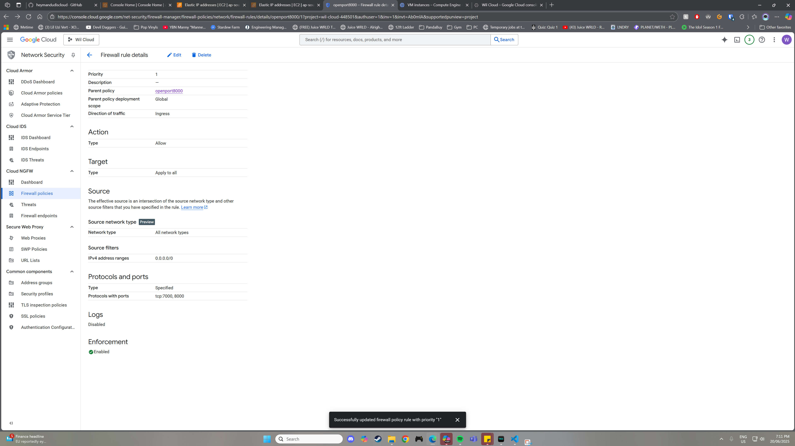
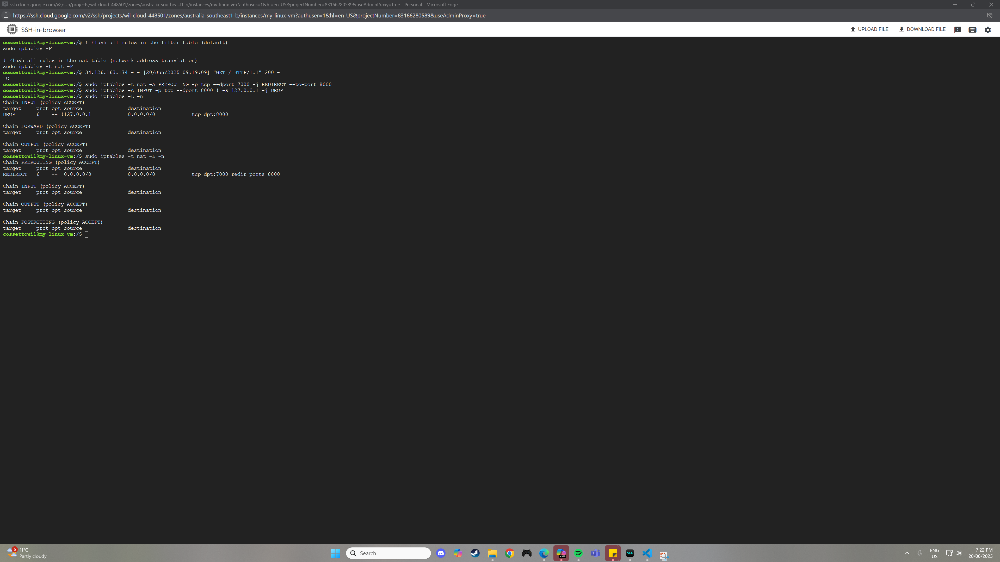

## Linux Firewall Rules Journal

### Goal

We wanted to understand how easy or difficult it is to manage firewall rules both on Google Cloud Platform (GCP) — using its VPC firewall — and on a Debian VM using Linux's native firewall tool, **`iptables`**.

---

### Considerations

We launched a Debian VM (latest version) on GCP. Initially, we were unsure what firewall tools or services came pre-installed.

We found that `iptables` was already available, and `python3` was installed, allowing quick web server testing without extra setup.

Directly editing `iptables` configuration files wasn't possible or recommended; instead, using `iptables` commands was the way to manage firewall rules.

We considered using `ufw` (Uncomplicated Firewall), but chose to stick with `iptables` to gain experience since on some systems package installation might be restricted.

**Image 1: Screenshot of GCP VPC firewall rules showing open ports 7000 and 8000**


---

### Investigation & Commands Used

The core commands we used during our exploration were:

```bash
# Running a basic python3 http server in the background on port 8000
python3 -m http.server 8000 &

# Redirect incoming TCP traffic on port 7000 to port 8000
sudo iptables -t nat -A PREROUTING -p tcp --dport 7000 -j REDIRECT --to-port 8000

# Block direct external access to port 8000, but allow localhost
sudo iptables -A INPUT -p tcp --dport 8000 ! -s 127.0.0.1 -j DROP
```

These commands represent a simple setup where:
- There is a basic HTTP server serving files from the current directory on port **8000**
- Incoming connections to port **7000** are redirected locally to port **8000**.
- Direct access to port **8000** is blocked, except from localhost.

---

### Flushing and Viewing `iptables` Rules

To reset or clear firewall rules during testing, we used:

```bash
# Flush all rules in the filter table (default)
sudo iptables -F

# Flush all rules in the nat table (network address translation)
sudo iptables -t nat -F
```

To inspect the current rules:

```bash
# View regular (filter) table rules with numeric addresses and ports
sudo iptables -L -n

# View NAT table rules (such as PREROUTING redirects)
sudo iptables -t nat -L -n
```

These commands helped us track changes and debug issues while configuring firewall behviour.


**Image 2: Screenshot of default `iptables` (filter table) and `nat iptables` rules after setup**


---

### Outcomes and Reflection

- The commands above were simple and effective for basic port redirection and blocking.
- Managing `iptables` via command line is straightforward once you understand the basics.
- Using `iptables` directly provides fine-grained control compared to simpler frontends like `ufw`.
- Flushing rules regularly during testing avoids conflicting rules and makes troubleshooting easier.
- Working with `iptables` felt easier and faster when using an AI assistant (like ChatGPT) for quick command syntax reminders and troubleshooting help.
- Ultimately, we were unsuccessful in fully redirecting port 7000 to 8000 due to some unexplained issue preventing the redirect from working correctly.
- With more time and investigation, it’s likely this could have been figured out, but the problem remained unresolved within our current exploration.