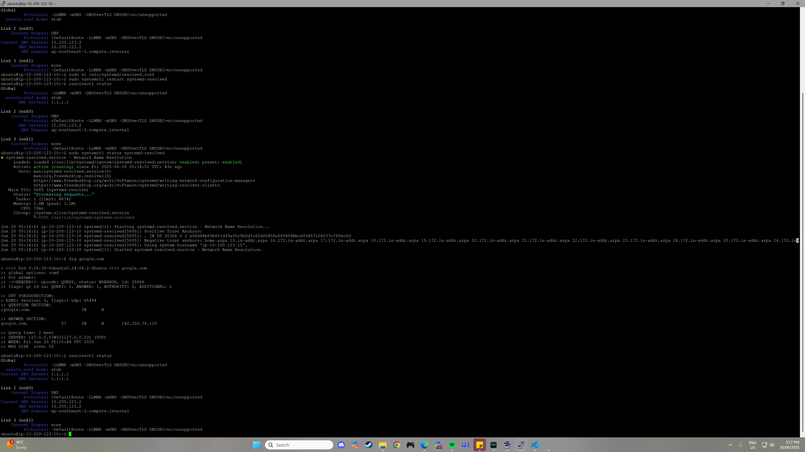
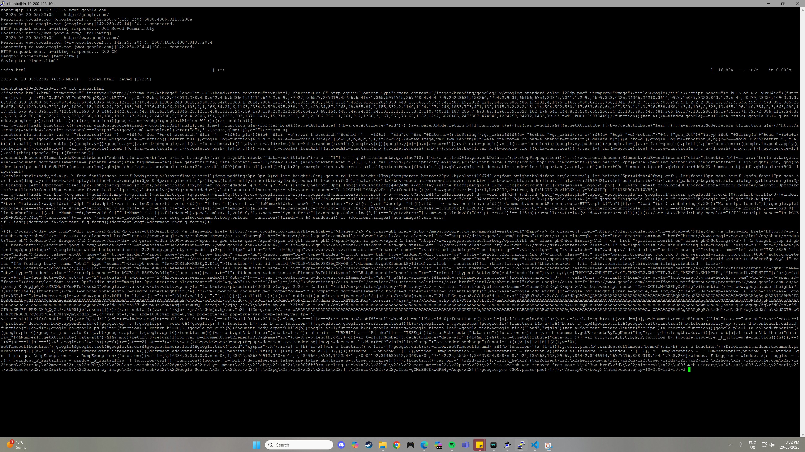
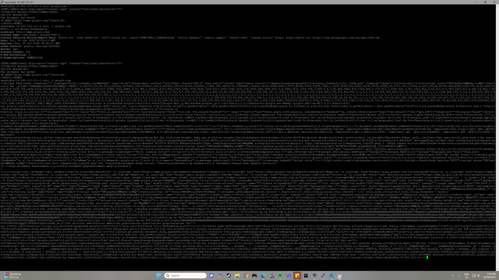

## Resolver



In this tutorial, we explored how to manually configure a Linux system's DNS resolver by editing the `resolved.conf` file managed by `systemd-resolved`.

The main objective was to change the system's DNS server to **Cloudflare’s DNS (`1.1.1.1`)**, which can improve domain resolution speed and enhance privacy by avoiding ISP-based DNS logging.

1. **Opened the DNS configuration file using `vi`:**

   ```bash
   sudo vi /etc/systemd/resolved.conf
   ```
2. **Edited the file to set the new DNS server:**
Inside the file, we uncommented and modified the DNS= line as follows:

    ```conf
    DNS=1.1.1.1
    ```
3. **Restarted the DNS resolver to apply changes:**

    ```bash
    sudo systemctl restart systemd-resolved
    ```
4. **Verified the new DNS settings using `resolvectl`:**

    ```bash
    resolvectl status
    ```

This confirmed that the Global DNS setting was now correctly pointing to 1.1.1.1.

## Wget vs Curl

Both `wget` and `curl` are tools used to get web pages, but they work a bit differently:

- When you run `wget google.com`, it **downloads the Google homepage and saves it as a file** (usually named `index.html`) on your computer. You can then open this file later in a browser or edit it.

- When you run `curl google.com`, it **fetches the Google homepage and shows the HTML content right in the terminal**. It doesn’t save the file unless you tell it to.



This command downloads the page and saves it as a file on disk. In this example I downloaded the google.com HTML file and used the `cat` command to show its contents.



This command fetches the page and displays the HTML output directly in the terminal. In this example I ran the command and got the HTML contents for google.com which turns out to be a HTML page telling me the page has been moved. I then used the same command with the `-i` flag to include the HTTP header along with the HTML contents. As the page has been moved I then ran the initial `curl google.com` command along with the `-L` flag which follows redirects automatically until it reaches the final page which resulted in google.com's HTML contents to be outputted.