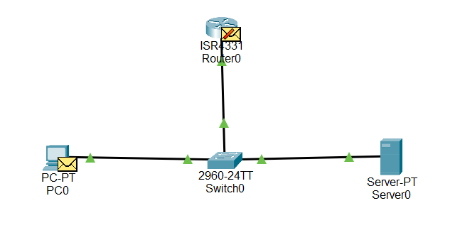

# State of the Network

While exploring Packet Tracer, I simulated a network that includes a PC, router, and DHCP server, all connected to a single switch.
In this simulation the PC ran the `ipconfig` command in cmd to see if it had an IP address, which it didn't. Thus we used the `ipconfig /renew` command to try get one.

When we initiated the IP assigning process, a broadcast frame was sent out from the PC to the switch which redirected the packet to the router and DHCP server as it was a broadcast.
The router dropped the frame as it wasn't the DHCP server in which the frame was for. The DHCP accepts the frame and send out a Gratuitous ARP (GARP) frame to the switch which sends to both the PC and the router.
The router was not the intended target for the GARP frame so it drops it and the PC has no IP address so it cannot yet reply.
The DHCP server then sends an IP address to the switch intended for the PC, however the switch forwards it to both the router and PC, so the router drops it and the PC accepts it.
The PC then sends a reply to the DHCP server acknowledging its new IP address which the switch forwards to once again, the router and the DHCP server so the router drops it.
The DHCP server sends a final confirmation frame, to which goes to the switch which once again forwards to the PC and router (Spoiler: the router drops it).
In reply the PC sends a GARP frame broadcasted to the network, announcing its new IP address.
This GARP frame is broadcasted out and dropped by both the DHCP server and the router.
This marks the end of the IP renewing process.

The way we configured this network, the DHCP server had an IP of 192.168.0.100 and we told the DHCP server to start handing out IPs from 192.168.0.101, with a subnet mask of 255.255.255.0. We limited the DHCP scope to 100 IP addresses to keep it simple. Additionally, the DHCP server was configured to provide the Default Gateway and DNS server addresses, both set to the router at 192.168.0.1.