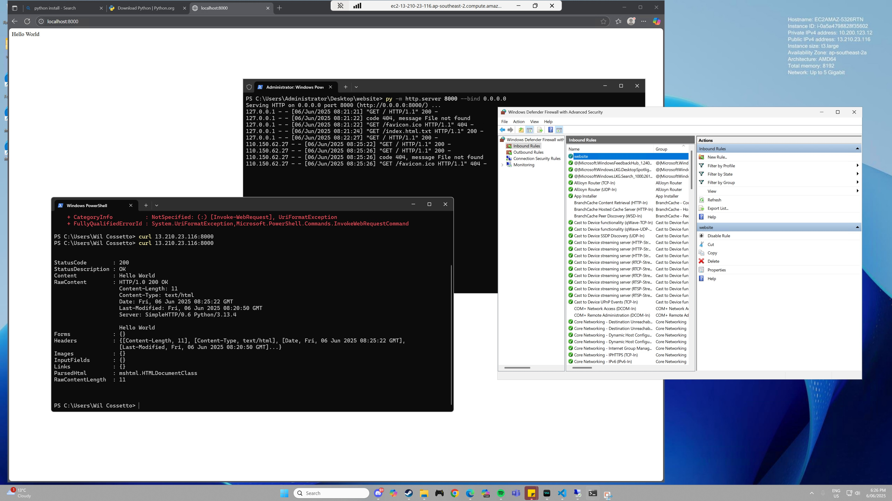

## Firewall Rules Testing Locally

When attempting to test Firewalls locally, we determined its hard to test when you are using localhost because Firewall rules will not block traffic on the same network so we need to attempt to access the network on a different machine.

## AWS Windows Server, Serving Simple Website

We were able to start a web server using Python to serve a simple static page.

The Firewall rules blocked everything without an inbound rule.

We added an inbound rule for port 8000, from our local machine we used `curl` and edge to see the server.

We also had to remember to open port 8000 on our AWS Security Group.

