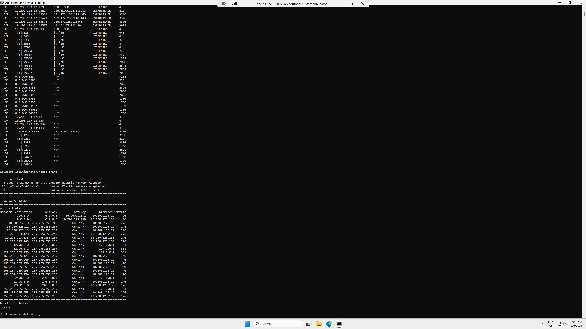

## Developer



I'm running a **t3.large EC2 instance** on **AWS**, following the setup demonstrated in the Cloud Environment tutorial by Tim. The instance is based on the **Windows Server 2025 AMI** and resides within my **VPC**, specifically in a **public subnet**.
This EC2 instance is configured with **two Elastic Network Interfaces (ENIs)**. Due to the lack of auto-assigned public IPs when using multiple ENIs, I manually attached an **Elastic IP (EIP)** to ensure external accessibility.
This setup enables a scalable and accessible Windows-based environment suitable for networking, system administration, or cloud infrastructure tasks.

## IPConfig

```cmd
ipconfig /all
```

Shows full IP configuration, including MAC address, DNS servers, and whether DHCP is enabled — helpful for diagnosing IP conflicts or DNS issues.

## Ping

```cmd
ping -n 5 google.com
```

Sends 5 ICMP echo requests to google.com to test internet connectivity and latency — useful for quick connectivity checks.

## Trace Route

```cmd
tracert -d 8.8.8.8
```

Traces the path to the IP address 8.8.8.8 without resolving hostnames, speeding up the process and showing IP hops.

## Netstat

```cmd
netstat -ano
```

Displays all connections with associated process IDs, letting you track down which program is using a specific port.

## Route

```cmd
route print -4
```

Prints the IPv4 routing table only — useful for checking default gateways and network interface priorities.